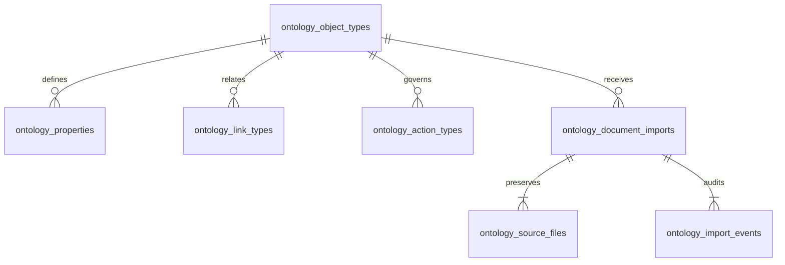

# Ontology Document Imports

## Ownership

The tenant ontology catalog defines object types, typed properties, relationship
cardinality, and registered actions. Each definition maps to an authoritative
ERP table or field. The production Ontology API reads those definitions from
the tenant database, and action execution rejects actions absent from the type.

External originals, extraction proposals, and review events are tenant-owned
evidence. They do not constitute a second business object store. Platform
ownership of organizations, permissions, provider configuration, and AI usage
is unchanged. No cross-database foreign keys are created for actor or invocation IDs.



## Formats and Models

- Up to five source files per import, 10 MiB each, 20 MiB combined.
- JPEG, PNG, WEBP: validated image headers, up to 40 million pixels.
- PDF: passed as a document input to a compatible multimodal model.
  The browser previews pages locally with PDF.js, without running document scripts.
- DOCX: bounded ZIP/XML extraction of the main document text. Embedded images
  and scanned pages should be supplied separately as image/PDF files.
- TXT and CSV: UTF-8, at most 120,000 bytes of combined extracted text.
- At most 200 business lines; monetary and quantity fields use six decimal places.

`DOCUMENT_IMPORT_PROVIDER_TYPE` and `DOCUMENT_IMPORT_MODEL` select a registered
AI Gateway model. When absent, the existing `BUSINESS_AI_*` defaults apply; if
neither model is selected, the recognizer chooses an active catalog model with
`vision`, `multimodal`, or `image_input` capability for binary inputs. An explicitly
selected model must support the uploaded modalities, including PDF input where
used. OpenAI-compatible providers vary in file-input support.
Both Docker Compose configurations forward the two document-import model
settings. PDF.js assets are served locally and prepared by the frontend
`predev`/`prebuild` scripts; previews do not send source files to a third-party viewer.

Missing model configuration or provider failure leaves a recoverable import,
with retry and manual review available. It never substitutes fabricated OCR
results. Requests contain no tools, and tool-call responses are rejected.
Source content is treated as untrusted evidence in the extraction prompt.
Provider usage is recorded by the normal gateway; source bytes are not written
into gateway metadata or API error messages.

Standard CSV works without a model. Use one document per file and repeat any
header values consistently across lines. Supported columns are `partner`,
`external_number`, `date`, `due_date`, `currency`, `total`, `tax`, `note`, `item`,
`warehouse`, `quantity`, `unit_price`, `tax_rate`, and `description`.
Common Chinese column labels are also accepted. For example:

```csv
external_number,partner,date,currency,item,warehouse,quantity,unit_price,tax_rate
EXT-2026-001,SUP-001,2026-09-15,CNY,ITEM-001,WHS-001,10,12.5,13
```

The operator must match partner, item, and warehouse values to existing master
data. Imports cannot create master data or allocation lines. Payment allocation
is a later governed action.

## API Workflow

All routes are authenticated tenant APIs below `/api/v1`; use the tenant token
and `X-Organization-ID`. Mutation endpoints require an authenticated human and
the corresponding ERP module/create permissions. Clients cannot supply actor
IDs or grant themselves review authority.

| Method and Route | Contract |
| --- | --- |
| `POST /document-imports` | Multipart `object_type` and one or more `files`; deduplicates by type and sorted content hashes |
| `GET /document-imports` | Required `object_type`, optional `status` and `cursor`; 50 rows per page |
| `GET /document-imports/{id}` | Original metadata, proposal, current review, and most recent 100 events |
| `GET /document-imports/{id}/files/{file}` | Authorized original download; no public source URLs |
| `POST /document-imports/{id}/recognize` | `{ "version": 1 }`; versioned recognition lease and proposal |
| `PATCH /document-imports/{id}/review` | `{ "version": 3, "draft": { "key": "...", "properties": {}, "lines": [] } }`; partial review allowed |
| `POST /document-imports/{id}/confirm` | Same reviewed draft and version, plus `"confirmed": true`; creates the business draft atomically |
| `POST /document-imports/{id}/reject` | `{ "version": 3 }`; retains evidence without creating a business document |

Supported object types are purchase orders, goods receipts, payable invoices,
outgoing payments, sales orders, deliveries, receivable invoices, incoming
payments, inventory receipts, and inventory issues. Discover types and property
mappings from `/ontology/types`; `importable` indicates eligible types.

The states are `uploaded`, `recognizing`, `needs_review`, `failed`, `confirmed`,
and `rejected`. Recognition runs outside database transactions with a two-minute
deadline. After a process failure, a lease older than three minutes can be retried
with the latest version. Saved human corrections survive recognition retries.
Concurrent or stale updates receive HTTP 409. A retry of an identical completed
confirmation returns its original result; changed drafts or versions conflict.

Confirmation validates required fields, reference types and active state, dates,
amounts, and line totals. It stores the business header, lines, source provenance,
ERP `import` action history, and reviewed snapshot in one transaction. Failure at
any step rolls back all effects. The resulting document remains a draft and can
enter the normal submission/approval/posting flow.

The document query API additionally accepts semantic `sort`, `direction`, and
`status`. Sort cursors are bound to the query and include a unique-key tie breaker;
null values sort last. `total` counts all matching records, not only loaded rows.

## Verification

From `backend/` with PostgreSQL available:

```sh
go test ./...
RUN_FRESH_DB_MIGRATION_TEST=1 go test ./internal/pkg/database -run TestFreshBaselineMigrationsAgainstPostgres -count=1 -v
RUN_FRESH_TENANT_DB_MIGRATION_TEST=1 go test ./internal/pkg/tenantdb -run TestFreshTenantBusinessMigrationAgainstPostgres -count=1 -v
RUN_DOCUMENT_IMPORT_INTEGRATION_TEST=1 go test ./internal/domain/documentimport -count=1 -v
```

Use `MIGRATION_TEST_ADMIN_URL` for the administrative PostgreSQL database. The
integration suite creates and drops only its own temporary database and invokes
the tenant migration provisioner. Runtime tenant names retain the normal
`meta_org_xxxx` contract. Never run import repairs against an unrelated database.

From `frontend/`, use `npm run test:document-imports`, `npm run test:ui`, and
`npm run build`. UI fixtures check review/confirmation behavior and bilingual
desktop/mobile layouts. Protocol fixtures verify binary input serialization;
live OCR quality requires a configured provider and is a separate check.

`npm run test:document-imports:live` runs against a local frontend/backend with
the SaaS administrator and tenant credentials documented in the repository.
It provisions the sample tenant through the platform API and retains uniquely
named verification records. It verifies real CSV recognition, human confirmation,
idempotent retries, numeric ontology queries, authenticated originals, and history;
it does not configure or mock an OCR provider.
